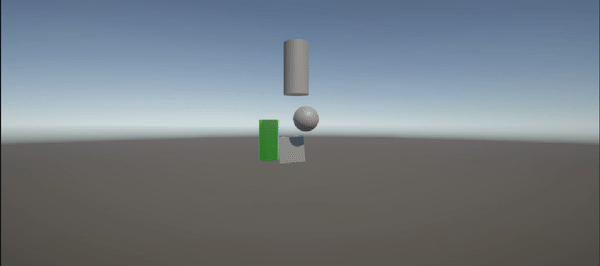

# II-Physics

## Descripción

En esta escena se han utilizado objetos 3D básicos como un cubo, esferas y cilindros. Los scripts implementados permiten manipular estos objetos de diversas maneras, como cambiar sus posiciones y manejar colisiones, aplicando conceptos de física en Unity.

---

## Scripts

### CubeVelocity.cs

Este script implementa el ejercicio 1, manejando la velocidad del cubo y mostrando información en la consola.

Características principales:
- Permite cambiar la velocidad del cubo desde el inspector.
- Muestra en la consola el resultado de multiplicar la velocidad por el valor del eje vertical y horizontal.
- Detecta las teclas de flecha y muestra el mensaje correspondiente.

### CubeMovement.cs

Este script implementa los ejercicios 2, 3, 4 y 5, controlando el movimiento del cubo.

Características principales:
- Permite especificar la dirección del movimiento y la velocidad en el inspector.
- Mueve el cubo en la dirección especificada.
- Permite mover el cubo con las teclas de flecha.
- El movimiento es proporcional al tiempo transcurrido entre frames.

### SphereMovement.cs

Este script complementa el ejercicio 4, controlando el movimiento de la esfera usando las teclas WASD.

Características principales:
- Permite mover la esfera usando las teclas W, A, S y D.
- Aplica el movimiento basado en el input del usuario.

### CubeSphereMovement.cs

Este script implementa los ejercicios 6 y 7, haciendo que el cubo se mueva hacia la esfera.

Características principales:
- Encuentra la esfera en la escena.
- Mueve el cubo hacia la esfera.
- Hace que el cubo mire hacia la esfera.

### Rotation.cs

Este script implementa el ejercicio 8, rotando y moviendo un objeto hacia adelante.

Características principales:
- Rota el objeto alrededor de su eje Y.
- Mueve el objeto hacia adelante.
- Dibuja un rayo de debug en la dirección de movimiento.

### KinematicCube.cs

Este script complementa el ejercicio 10, manejando las colisiones del cubo cinemático.

Características principales:
- Detecta y registra colisiones con otros objetos.
- Detecta y registra triggers con otros objetos.

### CylinderCollision.cs

Este script implementa los ejercicios 9, 10 y 11, manejando las colisiones del cilindro.

Características principales:
- Detecta y registra colisiones con otros objetos.
- Detecta y registra triggers con otros objetos.

### SphereCollision.cs

Este script complementa los ejercicios 10 y 11, manejando las colisiones de la esfera física.

Características principales:
- Detecta y registra colisiones con otros objetos.
- Detecta y registra triggers con otros objetos.

### CylinderMovement.cs

Este script implementa el ejercicio 12, controlando el movimiento del cilindro físico.

Características principales:
- Permite mover el cilindro usando las teclas I, K, J y L.
- El cilindro rota para mirar hacia la esfera.
- Usa física para el movimiento (Rigidbody).
- Permite un movimiento adicional hacia la esfera al presionar la barra espaciadora.

---

## Autor

Álvaro Fontenla León
